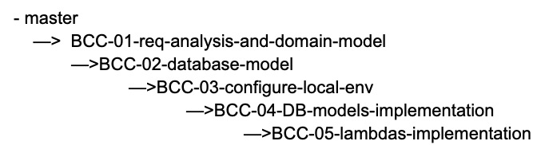

# Backend Challenge Instructions

1. Unzip the original repository.

2. Create a new private repository on your GitHub account.

3. Add the following GitHub users as collaborators to your new repository: `smarichal`, `nabil-brickken`.

4. Clone your new repository to your local development environment.

5. Copy the content from the original repository to your new repository.

6. Make the initial commit.

7. Bellow in this document you will find the tasks to be completed within this challenge. The tasks should be performed in order. For each task, create a new branch with the same name of the task. All the tasks are described in different documents in the folder `docs`. For example, for the first task named `BCC-01-req-analysis-and-domain-model.md` you should create a branch named `BCC-01-create-domain-model`.

8. Once you complete a task, create a pull request with the main branch as the base.

9. For the next task, create a new branch from the branch of the previous task (not from the main branch). When
   finished, create a pull request with the branch of the previous task as the base.

10. Repeat step 9 for all remaining tasks.

### Branching Strategy

Remember that each pull request should be reviewed and approved before being merged with the base branch. Keep your
commits small and frequent to facilitate code review.

### Tasks

Requirements Analysis and Domain model

[Requirements Analysis and modeling](./docs/BCC-01-req-analysis-and-domain-model.md)

Database model

[Relational database model](./docs/BCC-02-database-model.md)

Local dev environment configuration

[Configure local development environment](./docs/BCC-03-configure-local-env.md)

DB Models implementation 

[DB Models implementation](./docs/BCC-04-DB-models-implementation.md)

Lambdas implementation 

[Lambdas implementation](./docs/BCC-05-lambdas-implementation.md)

