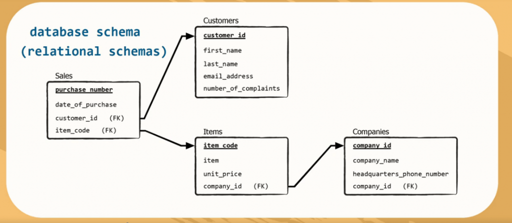

# Database model

Based on the output of the previous task, design the relational database schema. This task is about the design, not the sql script. 

### Deliverable: Relational schema design 

Update the document(s) to `doc/database`

See an example of what is expected:  

It's mandatory to indicate which are the Primary keys, Foreign Keys and column types (integer, varchar, uuid, etc). 
